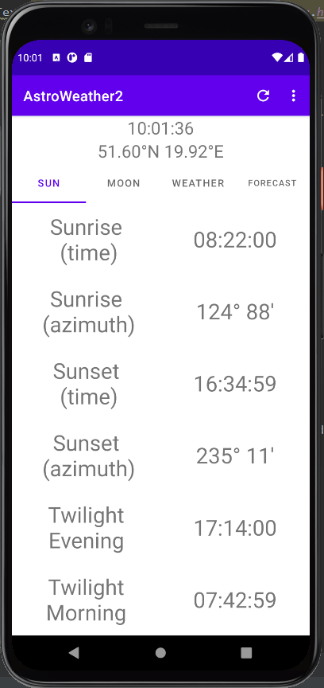
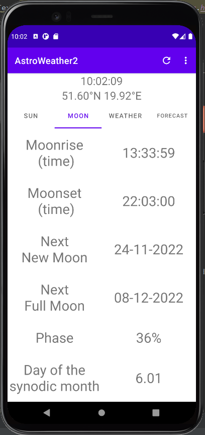
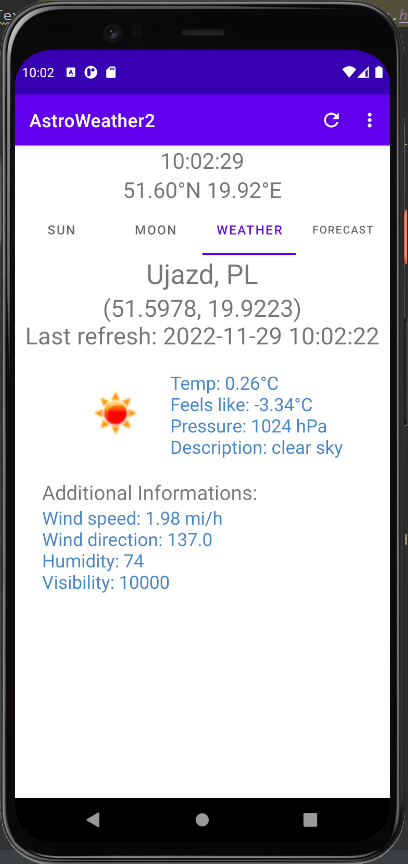
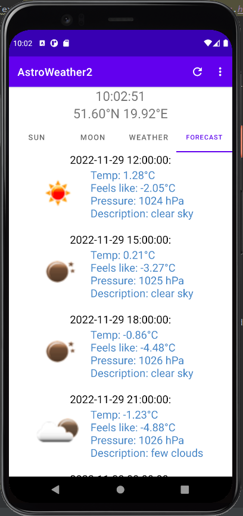
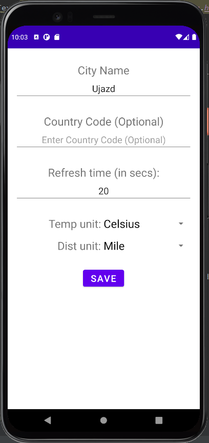
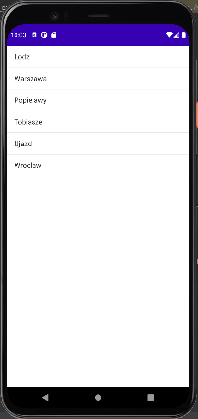

# Astro Weather

Application for Android devices to check information about the sun, moon and weather.

### Technologies used:

  
  

## Detailed description of the application

The Astro Weather application allows you to check information about the sun, moon, weather and forecast in the location of your choice.

### Sun information

After starting the application in the SUN tab, we can find information about:
- sunrise (time)
- sunrise (azimuth)
- sunset (time)
- sunset (azimuth)
- twilight evening
- twilight morning

### Moon information

After starting the application in the MOON tab, we can find information about:
- moonrise (time)
- moonset (time)
- next new moon
- next full moon
- phase
- day of the synodic month

### Weather

In the weather tab we can find information about the current weather. In addition, w have there information about when the data was last refreshed.

### Forecast

In the forecast tab we can find inforation about forecast in the form of scrollable list.

## Settings

The application also allows you to change the settings. On the settings page you can change:
- Name of the city (For which data will be collected in the application)
- (optional) Country name
- frequency of data refresh
- temperature unit (Kelvin, Celcius)
- distance unit (Miles, Kilometers)

In addition, the application saves the cities for which we searched for data, so we can easily switch between them.

